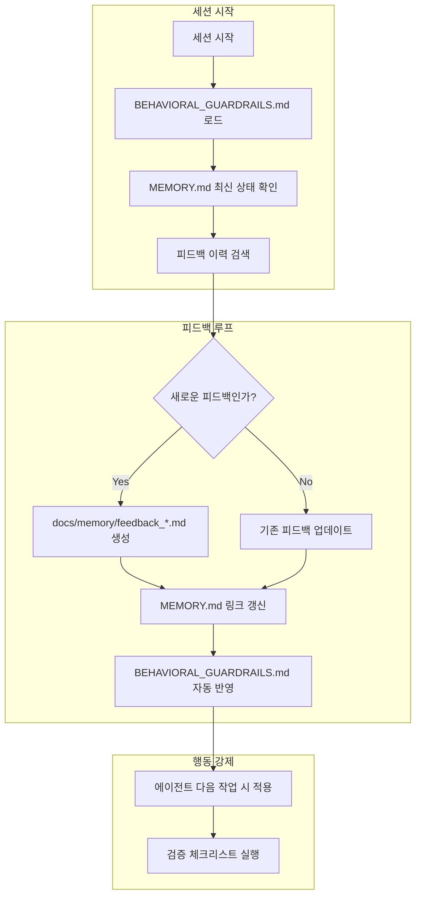

# 🧠 자기 강화 시스템 설계 계획

## §1. 개요

**목표**: AGENTS.md에 명시된 "스스로 작업할수록 더 강화되는 로직"을 구현하여, 프로젝트가 **메타 레벨에서 자가 증식**하도록 만든다.

**핵심 전략**:
1. **피드백 루프 강화** (Priority 4): `BEHAVIORAL_GUARDRAILS.md` ↔ `MEMORY.md` 연계
2. **지식 자산화 시스템** (Priority 3): 웹 검색 결과 자동 아카이브

---

## §2. 피드백 루프 강화 시스템

### 2.1 아키텍처 개요



### 2.2 데이터 모델

#### `docs/memory/feedback_*.md` 형식
```markdown
# Feedback: [제목]

## §1. 메타 정보
- **Last Verified**: 2026-04-13
- **Type**: [behavioral|process|workflow]
- **Source**: [user|system|test]

## §2. 피드백 내용
- **이슈**: [구체적인 문제]
- **근거**: [왜 이 문제가 중요한지]
- **제안 해결책**: [어떻게 고칠 것인지]

## §3. 적용 결과
- **BEHAVIORAL_GUARDRAILS.md**: [수정된 내용]
- **MEMORY.md**: [갱신된 링크]
```

### 2.3 자동화 로직

| 작업 | 도구 | 설명 |
|------|------|------|
| 피드백 감지 | `search_files` | `docs/memory/` 내 유사 피드백 검색 |
| 피드백 저장 | `write_to_file` | `docs/memory/feedback_*.md` 생성 |
| 인덱스 갱신 | `read_file` + `apply_diff` | `MEMORY.md` 링크 추가 |
| 수칙 반영 | `read_file` + `apply_diff` | `BEHAVIORAL_GUARDRAILS.md` 업데이트 |

---

## §3. 지식 자산화 시스템

### 3.1 아키텍처 개요

```mermaid
graph LR
    A[웹 검색 요청] --> B[docs/knowledge/ 검색]
    B --> C{문서 존재?}
    C -->|Yes| D[기존 문서 사용]
    C -->|No| E[최신 공식 문서 검색]
    E --> F[docs/knowledge/{topic}.md 생성]
    F --> G[MEMORY.md 링크 갱신]
```

### 3.2 데이터 모델

#### `docs/knowledge/{topic}.md` 형식
```markdown
# [주제] - 기술 자산

## §1. 메타 정보
- **Last Verified**: 2026-04-13
- **Source**: [URL]
- **Author**: [작성자/팀]

## §2. 핵심 솔루션
- **문제**: [기술적 문제]
- **해결책**: [구체적인 해결 방법]
- **코드 예시**: [relevant code block]

## §3. 프로젝트 적용
- **적용 위치**: [src/...]
- **적용 일자**: 2026-04-13
```

### 3.3 자동화 로직

| 작업 | 도구 | 설명 |
|------|------|------|
| 로컬 검색 | `list_files` | `docs/knowledge/` 내 파일 목록 확인 |
| 웹 검색 | `run_slash_command` | 최신 문서 검색 |
| 아카이브 | `write_to_file` | `docs/knowledge/`에 저장 |
| 인덱스 갱신 | `apply_diff` | `MEMORY.md` 링크 추가 |

---

## §4. 구현 단계

### Phase 1: 피드백 루프 (우선순위 4)
1. `docs/memory/feedback_template.md` 생성
2. 피드백 감지 및 저장 스크립트 개발
3. `MEMORY.md` 자동 갱신 로직 구현
4. `BEHAVIORAL_GUARDRAILS.md` 반영 로직 구현

### Phase 2: 지식 자산화 (우선순위 3)
1. `docs/knowledge/` 디렉토리 생성
2. `docs/knowledge/template.md` 생성
3. 웹 검색 → 아카이브 파이프라인 구현
4. `MEMORY.md` 자동 갱신 통합

### Phase 3: 통합 테스트
1. 샘플 피드백 입력 → 자동 아카이브 테스트
2. 샘플 웹 검색 → 자동 아카이브 테스트
3. `uv run pytest`로 전체 검증

---

## §5. 성공 지표

| 지표 | 목표 | 측정 방법 |
|------|------|-----------|
| 피드백 아카이브 시간 | < 30초 | `time` 명령어로 측정 |
| 지식 아카이브 시간 | < 60초 | `time` 명령어로 측정 |
| 인덱스 동기화 | 실시간 | `ls docs/memory/`로 확인 |
| 중복 방지 | 100% | `search_files`로 중복 검사 |

---

## §6. 향후 확장 가능성

- **AI 기반 피드백 분석**: LLM을 활용한 피드백 클러스터링
- **자동 코드 생성**: 피드백 → 스펙 → 구현 자동화
- **지식 그래프**: `docs/knowledge/` 간의 관계 맵핑
