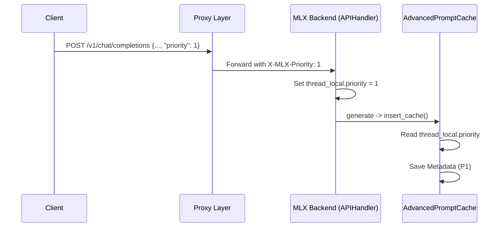

# [Plan] Priority-Aware Cache & SSD Longevity Optimization

본 계획은 API 요청에서 `priority` 필드를 추출하여 캐시 관리 로직에 반영하고, 빈번한 디스크 쓰기로부터 SSD 수명을 보호하기 위한 최적화를 수행합니다.

## 1. 목표
*   **우선순위 기반 캐싱**: 요청별 `priority`를 캐시 블록에 태깅하여 지능적 축출(Eviction) 및 스왑 수행.
*   **SSD 수명 최적화**: 스왑 쓰기 빈도를 조절하고 불필요한 IO를 최소화하여 SSD 마모 방지.

---

## 2. 세부 작업 Task

### Task 1: Proxy 레이어 고도화 (Priority 추출 및 전달)
*   [ ] `src/mlx_server/proxy.py`의 `proxy_to_mlx` 함수에서 JSON 바디의 `priority` 필드 추출.
*   [ ] 해당 정보를 내부 MLX 서버로 전달하기 위해 `X-MLX-Priority` 커스텀 헤더 추가.
*   [ ] `src/mlx_server/backend.py`에서 `APIHandler`를 서브클래싱하여 `X-MLX-Priority` 헤더를 감지.
*   [ ] `threading.local()`을 사용하여 현재 요청의 우선순위를 `AdvancedPromptCache`가 참조할 수 있도록 전파.

### Task 2: AdvancedPromptCache 연동
*   [ ] `src/mlx_server/cache_utils.py`의 `insert_cache` 메서드 수정.
    *   매개변수 혹은 `threading.local`을 통해 전달된 `priority`를 `block_metadata`에 기록.
*   [ ] `evacuate_if_needed` 로직 강화: 우선순위가 높은 블록(P0, P1)은 최대한 VRAM에 유지하고, 낮은 우선순위부터 스왑/삭제.

### Task 3: SSD 수명 보호 (Swap Writing Optimization)
*   [ ] **Throttle/Cooldown 도입**: 동일 블록에 대한 연속적인 스왑 쓰기 방지.
*   [ ] **Lazy Swap**: 메모리 압박이 감지되어도 즉시 쓰지 않고, 일정 시간 이상 미사용된 블록만 스왑 대상으로 선정.
*   [ ] **Hash-based Deduplication**: 내용이 동일한 블록은 기존 디스크 파일을 재사용하여 물리적 쓰기 횟수 감소.
*   [ ] `PersistentCacheLayer`에 `write_buffer` 또는 `swap_cooldown` 로직 추가.

---

## 3. 예상 아키텍처 변경

### Priority Propagation Flow

### SSD Swap Optimization Logic
*   **Write Coalescing**: 짧은 주기의 반복적인 쓰기를 지연시켜 병합.
*   **Stable Block Selection**: 짧은 시간 내에 다시 사용될 가능성이 높은(최근 사용된) 블록은 스왑에서 제외.

---

## 4. 검증 계획
*   [ ] **Priority 기능 테스트**: 서로 다른 우선순위의 요청을 보내고, 메모리 압박 시 낮은 우선순위가 먼저 스왑되는지 확인.
*   [ ] **IO 벤치마크**: 대량 요청 시 SSD 쓰기 횟수/용량이 최적화 전후로 어떻게 변화하는지 모니터링.
*   [ ] **./verify.sh**: 기존 기능(Hit/Miss, Token Integrity) 회귀 테스트.

---

## 5. 리스크 및 대응
*   **Thread Safety**: `threading.local` 사용 시 요청 처리가 완료된 후 데이터를 반드시 클리어해야 함 (Memory Leak 방지).
*   **Performance Overhead**: 스왑 지연 로직이 추론 속도에 영향을 주지 않도록 정교한 비동기 처리 필요.
