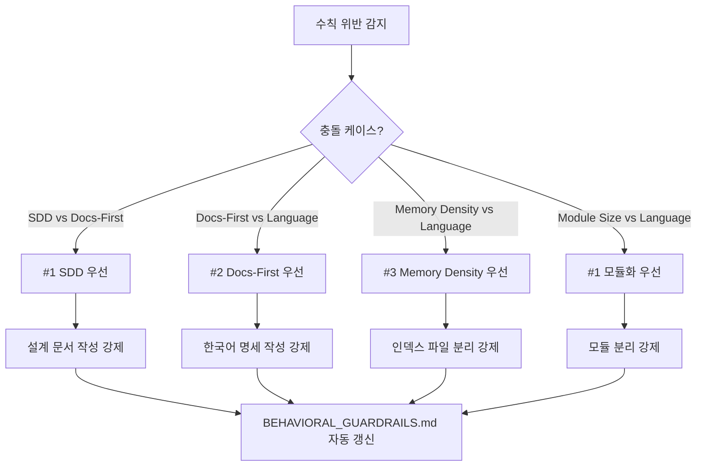

# 🛡️ Behavioral Enforcement System (행동 수칙 강제 시스템)

## §1. 메타 정보
- **Last Verified**: 2026-04-13
- **Purpose**: BEHAVIORAL_GUARDRAILS.md 수칙 위반을 자동 감지하고 보고/수정하는 시스템
- **Reference**: `docs/memory/BEHAVIORAL_GUARDRAILS.md`, `docs/memory/feedback/`

---

## §2. 위반 감지 키워드 매트릭스

### 2.1 감지 대상 카테고리

| 카테고리 | 감지 키워드/패턴 | 위반 수칙 | 감지 위치 |
|----------|------------------|-----------|-----------|
| **Planner Violation** | `docs/plans/` 외부 `*.md` 생성 | #1 SDD 설계 문서화 | `git diff --name-only` |
| **Docs-First Violation** | `TODO: docs`, `FIXME: specs` | #2 Docs-First | 코드/문서 주석 |
| **Language Violation** | 영문 주석/문서 (`[A-Z][a-z]+` 다단어) | #4 Language | 모든 `.md`/`.py` |
| **Memory Drift** | `MEMORY.md` 200라인 초과 | #3 Memory Density | `wc -l docs/memory/MEMORY.md` |
| **Module Size** | `src/**/*.py` 500라인 초과 | AGENTS.md 모듈화 기준 | `wc -l src/**/*.py` |

### 2.2 감지 주기
- **실시간**: `git commit` 시 `pre-commit` 훅 (미구현)
- **주기적**: 매 세션 종료 시 `uv run python scripts/behavioral_audit.py`

---

## §3. 수칙 우선순위 충돌 해결 매트릭스

### 3.1 충돌 시나리오

| 충돌 케이스 | 우선순위 | 결정 로직 | 예시 |
|-------------|----------|-----------|------|
| **SDD vs Docs-First** | #1 SDD 우선 | 설계 문서화 없이 명세만 수정하면 "설계 누락" 위반 | 기능 구현 전 `docs/plans/` 작성 필수 |
| **Docs-First vs Language** | #2 Docs-First 우선 | 영문 명세는 "Docs-First" 위반으로 간주 | `docs/specs/`는 한국어로 작성 |
| **Memory Density vs Language** | #3 Memory Density 우선 | `MEMORY.md` 200라인 초과 시 언어 강제 해제 | 인덱스 파일은 링크만 유지 |
| **Module Size vs Language** | #1 모듈화 우선 | 500라인 초과 시 언어 무시하고 분리 | `src/**/*.py` 500라인 초과 시 즉시 분리 |

### 3.2 충돌 해결 워크플로우



---

## §4. 자동 보고 프로토콜

### 4.1 보고 형식

```markdown
# Feedback: [위반 유형] - [날짜]

## §1. 메타 정보
- **Last Verified**: [YYYY-MM-DD]
- **Type**: violation
- **Source**: system
- **Related**: [BEHAVIORAL_GUARDRAILS 항목]

## §2. 위반 내용
- **위반 수칙**: [수칙 번호 + 제목]
- **위반 내용**: [구체적인 위반 사항]
- **위반 위치**: [파일 경로 + 라인 번호]

## §3. 해결 방안
- **수정 제안**: [어떻게 고칠 것인지]
- **우선순위**: [High/Medium/Low]

## §4. 적용 결과
- **BEHAVIORAL_GUARDRAILS.md**: [수정된 내용]
- **MEMORY.md**: [갱신된 링크]
- **적용 일자**: [YYYY-MM-DD]
```

### 4.2 자동 보고 워크플로우

```mermaid
flowchart TD
    A[위반 감지] --> B[위반 유형 분류]
    B --> C[보고 파일 생성: feedback_violation_[YYYYMMDD]_[hash].md]
    C --> D[BEHAVIORAL_GUARDRAILS.md 자동 갱신]
    D --> E[MEMORY.md 링크 추가]
    E --> F[콘솔 보고: "⚠️ 위반 감지 - 자동 보고 생성"]
```

---

## §5. 주기적 리뷰 워크플로우

### 5.1 리뷰 스케줄

| 리뷰 유형 | 주기 | 스크립트 | 산출물 |
|-----------|------|----------|--------|
| **세션 종료 리뷰** | 매 세션 종료 | `uv run python scripts/behavioral_audit.py` | `docs/memory/project_status.md` 갱신 |
| **주간 리뷰** | 매주 금요일 | `uv run python scripts/behavioral_audit.py --weekly` | `docs/memory/project_changelog.md` 갱신 |
| **월간 리뷰** | 매월 1일 | `uv run python scripts/behavioral_audit.py --monthly` | `docs/memory/MEMORY.md` 정리 |

### 5.2 리뷰 체크리스트

- [ ] 위반 감지 이력이 `docs/memory/feedback/`에 정리되었는가?
- [ ] `BEHAVIORAL_GUARDRAILS.md`가 최신 피드백을 반영했는가?
- [ ] `MEMORY.md`가 200라인 이내인가?
- [ ] `docs/plans/`에 미적용 플랜이 없는가?

---

## §6. 구현 계획

| 단계 | 작업 | 산출물 | 우선순위 |
|------|------|--------|----------|
| 1 | 감지 키워드 매트릭스 정의 | `docs/specs/behavioral_enforcement.md` | ✅ 완료 |
| 2 | `feedback_processor.py` 개선 | `scripts/feedback_processor.py` | High |
| 3 | `behavioral_audit.py` 생성 | `scripts/behavioral_audit.py` | High |
| 4 | `tests/test_behavioral_compliance.py` | `tests/test_behavioral_compliance.py` | Medium |
| 5 | `BEHAVIORAL_GUARDRAILS.md` 최신화 | `docs/memory/BEHAVIORAL_GUARDRAILS.md` | Low |

---

## §7. 향후 확장 가능성

- **Git Hook 통합**: `pre-commit` 훅으로 실시간 감지
- **CI/CD 통합**: `pytest` 실행 전 자동 감지
- **AI 기반 감지**: LLM을 활용한 문맥 기반 위반 감지
